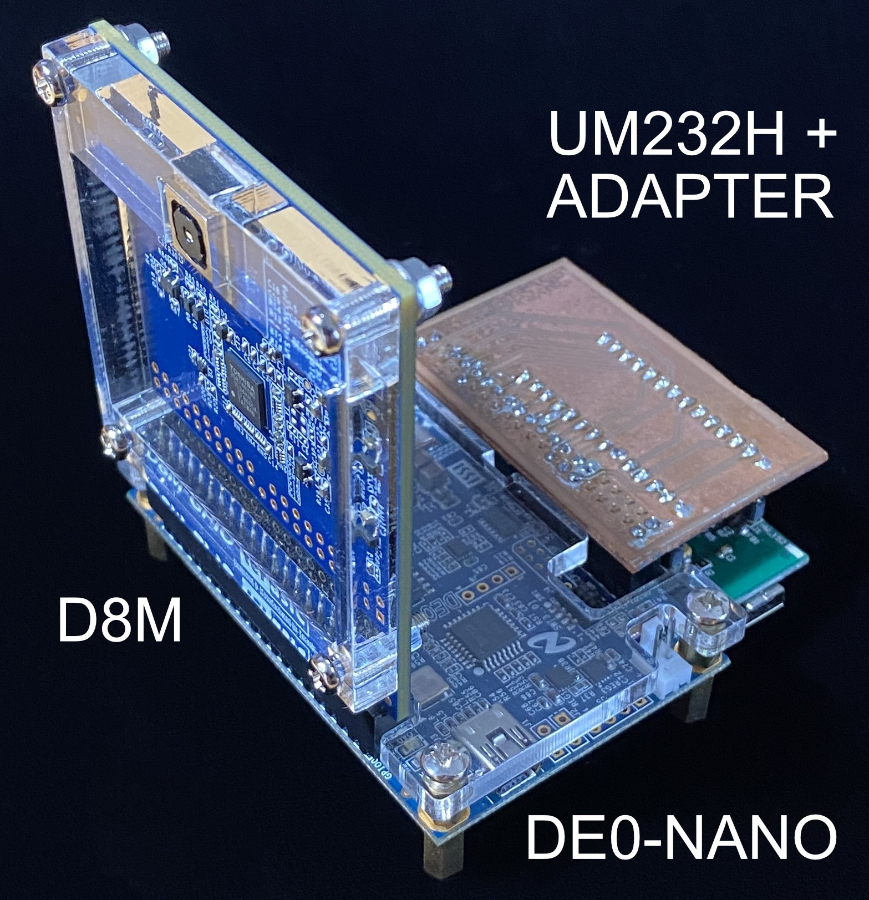
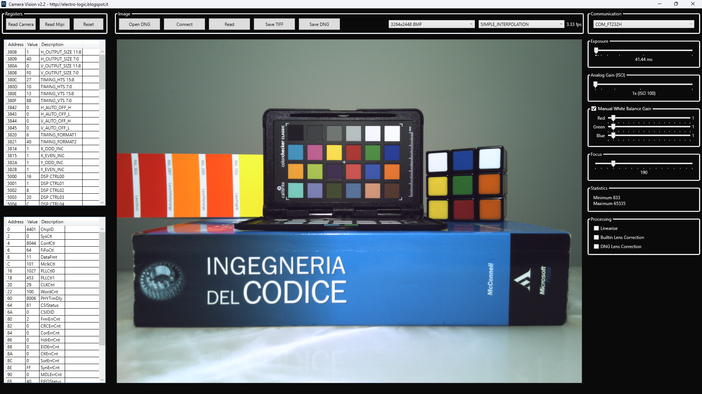
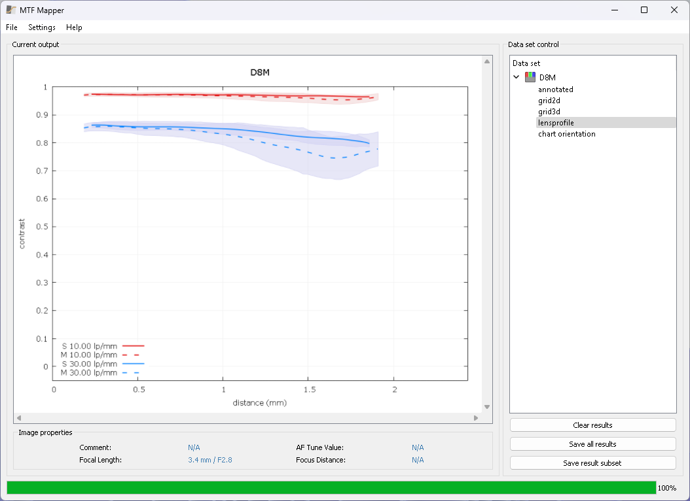

# Camera Vision 2

Connect a modern, high-resolution camera to an FPGA and easily develop your applications

_Check out https://electro-logic.blogspot.com for additional documentation and articles.._

This project is the evolution of [Camera Vision 1](https://github.com/electro-logic/CameraVision) bringing more details (10 bit versus 8 bit) and a faster communication (USB 2.0 Hi-Speed versus USB 1.0) 

What's new:

- Full 10 bit support
- JTAG only / JTAG + USB 2.0 communication options
- TIFF + DNG RAW export with metadata
- Processing: Linearize, Builtin / DNG Lens Correction
- Editor can works offline for debayering, export, etc..
- Editor mouse info: X/Y, Rgb, RAW, RAW AVG5
- Image Statistics, Download progress
- New MIPI and Camera registers
- Updated toolchain for a modern development environment

Required Software to compile the project:

- Microsoft Visual Studio 2022 (WPF / .NET 6)
- Intel Quartus Prime 18.1 (Standard or Lite Edition)

Required Hardware to run the project:

- Terasic DE0-Nano (Cyclone IV 22K LEs FPGA), DE1-SoC (Cyclone V 85K LEs FPGA, experimental) or another Terasic compatible dev board (see FAQ)
- Terasic D8M (OV8865 Image Sensor + MIPI Decoder TC358748XBG)

Optional Hardware:

- FTDI UM232H with DE0-Nano [board adapter](https://electro-logic.blogspot.com/2014/03/fpga-comunicazione-ad-alta-velocita_99.html)

Quick start:

1) Connect D8M into GPIO0 of DE0-Nano as shown into images into \doc folder 
2) Connect DE0-Nano to PC with the USB cable bundled

optional 2b) Connect UM232H with the adapter into GPIO1

optional 2c) Connect UM232H to PC with an USB 2.0 cable. The module should be [configured](https://electro-logic.blogspot.com/2014/02/fpga-comunicazione-ad-alta-velocita_16.html) with the FT_PROG utility.

3) Program the bitstream \de0-nano\output_files\DE0_NANO_D8M.sof into the DE0-Nano with Quartus Programmer 
4) Wait that LED0 turn on and launch CameraVision.exe (available compiled or can be compiled from the source code)
   
optional 4b) Select COM_FT232H from the Communication panel if you are using the UM232H

5) Press the Read button to take a new image

Optical Performances:

The tiny lens is pretty good in terms of sharpness evaluated with lines per millimeter (lp/mm) with the software [MTF Mapper](https://sourceforge.net/projects/mtfmapper/)

[MTF Data Download](docs/D8M_MTF.zip)

Notes: the calculated MTF is approximated. Proper measurements require an accurate setup. 

DE1-Soc:

Support for DE1-SoC is experimental. FT232H is not supported on DE1-SoC and GPIO 1 (JP2) should be used to connect D8M.

F.A.Q.

**Q) When I launch CameraVision.exe image is corrupted.**

A) Likely the MIPI Integrated Circuit on the D8M is out-of-sync. Please Read the MIPI bridge registers CSIStatus, FIFOStatus, etc.. (in normal conditions should be 0). Reprogram the FPGA or Try to press KEY0 on DE0-NANO to reset the system and launch again the software. Please enable the test color-bar by setting the camera register 0x5E00 to 0x80 to ensure that the problem is a data transmission error.

**Q) How can I edit the Nios II firmware?**

A) Open Quartus, click on Tools / Nios II Software Build Tools for Eclipse, File / Import, General / Existing Projects into Workspace, Select root directory: D:\FPGA\CameraVision2\eda\de0-nano\software where the path is you project location

**Q) Why there is a dim blue light in my images?**

A) Please cover the DE0-Nano on-board power led 

**Q) Why 10 bits images are required?**

A) RAW images are linear and 10-bit are required to retain quality after the gamma-encoding (ex. JPEG) 

**Q) Are sensor images ready to use?**

A) Images from the sensor are raw pixels and post-processing is required to improve the visual quality. This includes linearization, gamma-encoding, color correction, sharpening, etc..

**Q) Can I use another dev board?**

A) You can use any Terasic development board compatible with the D8M camera, for example DE2-115, DE1-SoC, DE0-CV, C5G, DE10-Lite, DE10-Standard, DE10-Nano, etc.. some changes may be required, always check and adapt the pinout for your board and the memory timing. Please open an issue if you need help with a specific board.

**Q) During the compilation I get the Error 12006**

A) You need to add the mipi_controller folder to the IP path in QSys / Tools / Options / Search Path and then regenerate the HDL. Note; QSys is named Platform Designer in latest releases of Quartus.

**Q) What's next?**

A) There is still room for improvements, for example:
- FT232H controller: fully utilise the USB 2.0 bandwidth by adding a FIFO memory to decouple the SDRAM memory
- Improve the protocol to use a single cable (ex. JTAG only or FT232H only)
- Add parameters to customize the mipi controller and the ft232h component from the Platform Designer
- Additional image statistics and histogram
- Video recording
- ASCOM driver to extend compatibility with other software
